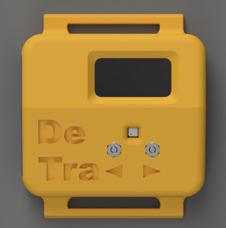
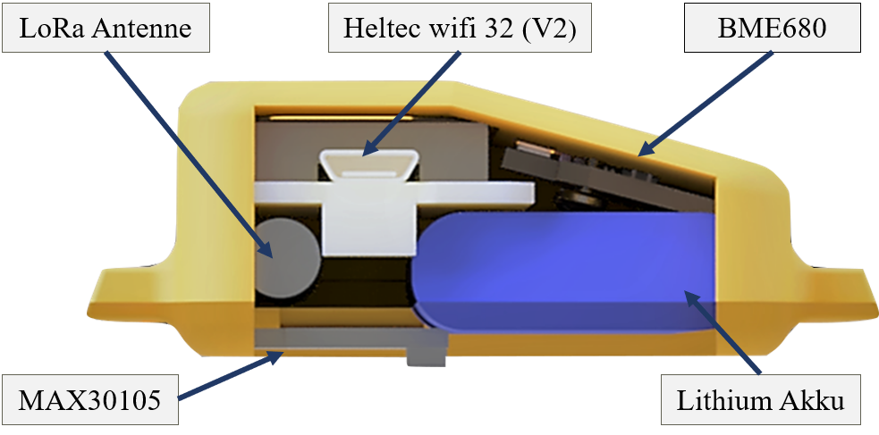
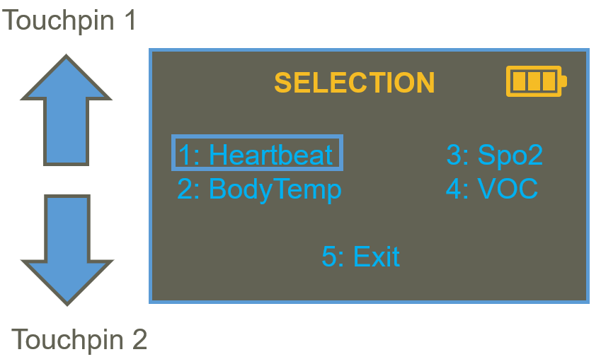
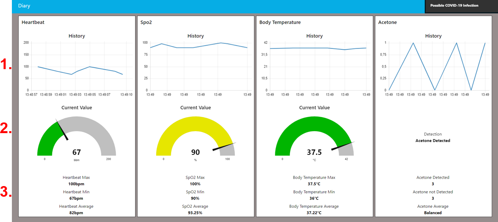

# COVID-19 Detector and Transmitter Bracelet (DeTra)
The smart bracelet detects symptoms of COVID-19/ SARS-CoV-2. It can wirelessly transmit the data to help centers or warn the person automatically

## Introduction
The COVID-19 Detector and Transmitter Bracelet is designed to detect possible COVID-19 outbreaks in crowded areas. In order to control the virus’ spread, data can either be transmitted to medical staff or advise the bracelet carrier to consult a doctor.

The low-cost architecture of the device and its use of low-power wide-area networks (LPWAN) makes it ideal for areas with limited or no internet coverage.

By using different sensors, DeTra measures vital signs such as heart rate, body temperature, and blood oxygen level, which indicate infection with COVID-19 when varying from their status quo.

The real-time data transmission occurs via long-range radio waves using an integrated antenna.

Additionally, other health problems can also be monitored using DeTra, e.g. by indicating an upcoming diabetic coma of diabetes type 1 patients.

## Operation of DeTra
DeTra is characterized by its user-friendly operation and its long battery life. DeTra is charged via Micro-USB. If DeTra is not used it falls into deep sleep mode. To collect data DeTra wakes up every 3 hours and measures the corresponding vital parameters. For entering the menu, one of the two touch pins on the front of DeTra needs to be pressed, which automatically wakes up the device.

Within the menu, the left touch pin is used to move the cursor up and the right touch pin is used to move the cursor down. When reaching the parameter to be measured, it will be selected automatically after a defined amount of time. To stop the measurement both pins need to be touched simultaneously and DeTra returns to deep sleep mode.

## Monitoring
In order to visualize the data, Node-Red receives the organized data from “The Things Network” and displays it in a dashboard for easy analysis by e.g. medical authorities.

Node-Red and “The Things Network” communicate via the MQTT protocol. For further processing, the format of the messages sent by “The Things Network” are converted from JSON strings into a JSON object.

The dashboard is divided into four columns: heartbeat, Spo2, body temperature, and acetone. The first row of each group shows the history of the measured values. The second row visualizes the current value. To get a better overview of the values, the last row visualizes the average value, as well as the maximum and minimum value, which are calculated and filtered out by DeTra.

If DeTra detected a possible COVID-19 infection, a notification on the right top of the Dashboard will pop up.

## Repository Contents
* **/src** - Source files for the library (.cpp, .h).
* **/examples** - Example sketches for the library (.ino). Run these from the Arduino IDE.
* **/Images** - Images for the repository.
